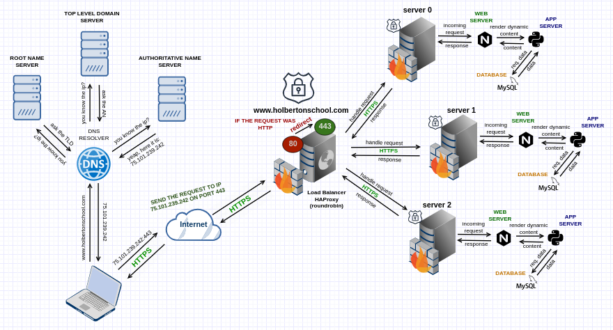

# 0x11. What happens when you type holbertonschool.com in your browser and press Enter

## Tasks

## 0. What happens when...
Write a blog post explaining what happens when you type `https://www.holbertonschool.com` in your browser and press Enter.

**The post must cover:**

- DNS request
- TCP/IP
- Firewall
- HTTPS/SSL
- Load-balancer
- Web server
- Application server
- Database

`File:` [0-blog_post](0-blog_post)

## 1. Everything's better with a pretty diagram
Add a schema to your blog post illustrating the flow of the request created when you type `https://www.holbertonschool.com` in your browser and press Enter.

**The diagram should show:**

-  DNS resolution
-  The request hitting server IP on the appropriate port
-  The traffic is encrypted
-  The traffic goes through a firewall
-  The request is distributed via a load balancer
-  The web server answers the request by serving a web page
-  The application server generates the web page
-  The application server request data from the database

`File:` [1-what_happen_when_diagram](1-what_happen_when_diagram)
